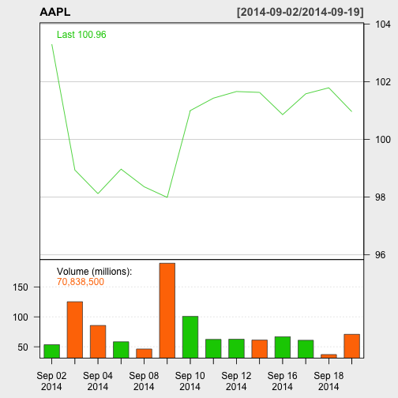

This app allows you to query stock information for five well-known tech companies:

- Apple
- Google
- Oracle
- Microsoft
- Yahoo

--- .class #id 

The stock information is presented in graphs for each selected company. Multiple selection will present the graphs side-by-side for easy comparison and analysis.

---

Here is an example of the graph. This is generated using an R packaged named quantmod.

 

---

The app is hosted on shinyapps.io. Go ahead and give it a try.

http://ithinkicancode.shinyapps.io/ShinyApp1

Look forward to any feedback. Thank you.

